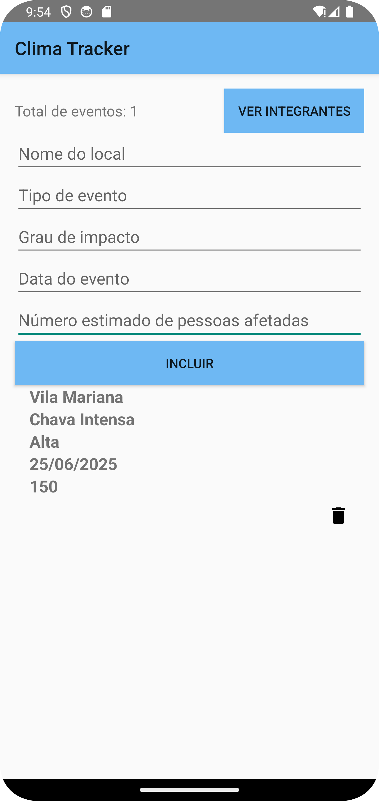
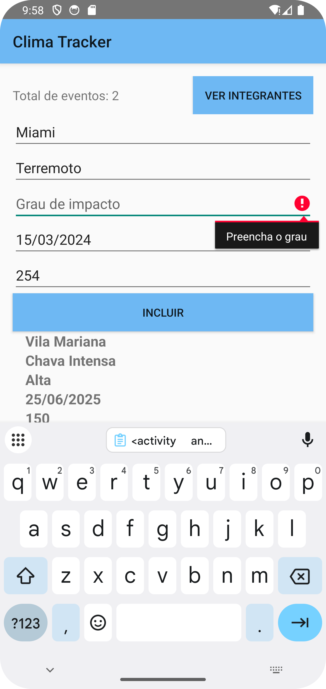
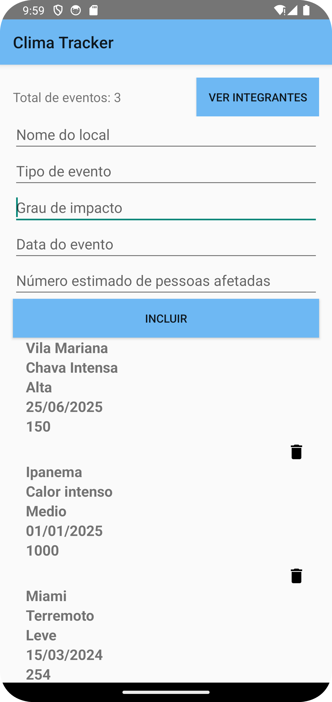
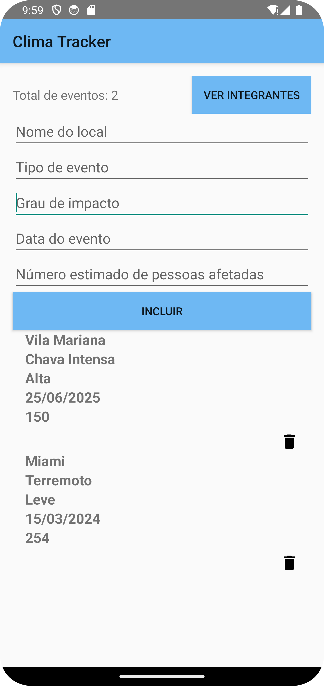

# Global Solutions - Android Kotlin 3-SIS

## Integrantes
- **Alana Carolayne Moreira Siqueira** – RM: 552261  
- **Ana Júlia Henriques Neves** – RM: 98263

---

## ✨ Funcionalidade Extra
Adicionamos a **contagem total de eventos cadastrados** ao app ✅

---

## 📱 Prints das Telas

### 🏠 Tela Inicial  

  

### ➕ Adicionando o 1° Evento  

  

### ⚠️ Teste: Número de Pessoas Atingidas = 0  

  

### ⚠️ Teste: Campo Vazio  

  

### ➕ Adicionando o 3° Evento  

  

### 🗑️ Excluindo o 2° Evento  

  

