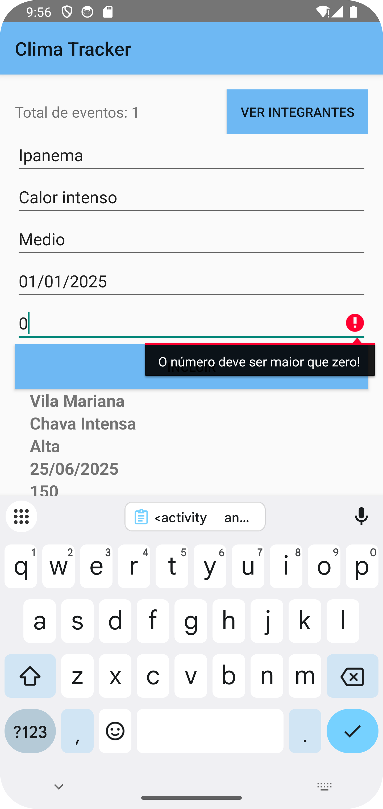

# Global Solutions - Android Kotlin 3-SIS

## Integrantes
### Alana Carolayne Moreira Siqueira rm:552261
### Ana Júlia Henriques Neves rm:98263

### Prints das telas

##### Tela inicial

##### Adicionando o 1° evento

##### Testando numero de pessoas afetadas igual a 0

##### Testando campo vazio

##### Adicionando o 3° evento

##### Excluindo o 2° evento

## Funcionalidade extra
### Adicinamos a contagem total de eventos cadastrados